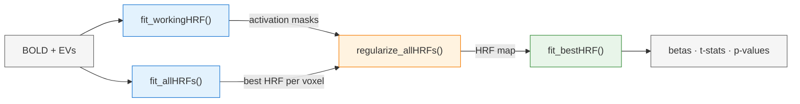

# HRF Adaptation Pipeline

Four stages, run in order. Outputs feed forward.



## `fit_workingHRF`
Fits a GLM per subject using a **single canonical HRF** (`a1=6, b1=1, c=1/6`).
Identifies voxels with significant task activation via F-stats.

**In:**
- BOLD CIFTI files
- event timings (EVs)
- nuisance regressors
- TR

**Out:**
- per-subject GLM results
- activation masks

## `fit_allHRFs`
Fits a GLM per subject across a **grid of HRF parameterizations** (~100+).
For each voxel × subject, finds the best-fitting HRF in the grid.

**In:**
- BOLD CIFTI files
- event timings (EVs)
- nuisance regressors
- TR
- HRF grid

**Out:**
- best `(a1, b1, c)` per voxel × subject
- RSS table for fast downstream lookup (when `save_rss=TRUE`)

## `regularize_allHRFs`
Combines both upstream outputs to produce a population-aware HRF map and (optionally) a per-subject **adapted HRF**.

1. Uses `fit_workingHRF` masks to keep only active voxels per subject
2. Uses `fit_allHRFs` best params to compute a population-averaged HRF map (per voxel)
3. Optionally builds 25 candidate maps and picks the best one per subject — this is the **adapted HRF**

### What candidate maps are
The population-average map is one HRF per voxel. We don't want to force every subject onto exactly that — subjects vary. So we generate **25 candidate maps** by shifting the population average:

- `a1_offsets = c(-2, -1, 0, 1, 2)` → 5 shifts in time-to-peak
- `b1_offsets = c(-0.5, -0.25, 0, 0.25, 0.5)` → 5 shifts in width
- 5 × 5 = **25 candidate HRF maps**

Each candidate is a small global perturbation of the population avg. For each subject, fit all 25 candidates and pick the one with lowest RSS (best fit). That winning candidate becomes that subject's **adapted HRF map** — population-anchored but personalized.

Modes:
- `save_rss=TRUE` → fast lookup using pre-computed RSS from `fit_allHRFs`
- `save_rss=FALSE` → refit GLMs for each candidate (slow, requires BOLD/EVs)

**In:**
- `fit_workingHRF` result
- `fit_allHRFs` result

**Out:**
- `pop_avg` HRF map (population-averaged)
- adapted HRF per subject = the **WINNING** candidate map (only if `seffects=TRUE`)

## `fit_bestHRF`
Final per-subject GLM using the **adapted HRF** (or population HRF, if `seffects=FALSE`) at each voxel. Computes contrasts, t-stats, and adjusted p-values.

**In:**
- `regularize_allHRFs` result
- BOLD CIFTI files
- event timings (EVs)
- contrasts

**Out:** a `bestHRF` object — see structure below.

### Structure of the `bestHRF` return object

```
result (class: "bestHRF")
├── working            # GLM using canonical HRF (a1=6, b1=1, c=1/6) — baseline
│   ├── betas              # xifti — task beta estimates per voxel
│   ├── contrasts
│   │   ├── est            # xifti — contrast estimates (A %*% beta)
│   │   ├── SE             # xifti — standard errors of contrasts
│   │   ├── tstat          # xifti — t-statistics (est / SE)
│   │   ├── pval           # xifti — two-sided p-values
│   │   └── pval_adj       # xifti — p-values adjusted across voxels (default: BH)
│   └── hrf_assignments    # data.frame — every voxel uses (a1, b1, c) of canonical HRF
├── adapted (or population)   # GLM using regularized HRF — name depends on mode
│   ├── betas              # xifti — task betas, now per-voxel HRF
│   ├── contrasts          # same five xiftis as above (est, SE, tstat, pval, pval_adj)
│   ├── hrf_assignments    # data.frame — actual (a1, b1, c) used per voxel
│   └── subject_idx        # which subject (only if seffects=TRUE / adapted mode)
├── df                  # integer — residual degrees of freedom (same across voxels)
└── contrast_matrix     # matrix A — the contrasts you requested (defaults to identity)
```

**Section name:** `adapted` when `regularize_result` has per-subject results (`seffects=TRUE`); `population` when it only has the population avg.

**`xifti`:** a `ciftiTools` object holding cortex-surface data — pass to `ciftiTools::view_xifti()` or `plot()` directly.

**Why `working` is included:** lets you compare the canonical-HRF result against the personalized result side-by-side (sanity check that adaptation helped).

**`hrf_assignments`:** for `working` it's all the same row repeated; for `adapted`/`population` it's the actual per-voxel HRF parameters used (one row per voxel with `voxel`, `a1`, `b1`, `c`).
